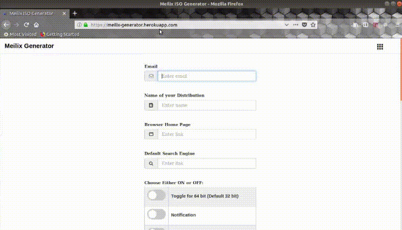

# Meilix Generator 

 

A webapp which generates an iso live image with a custom [Meilix](https://github.com/fossasia/meilix) Linux upon the request of a user. 

  - [fossasia/meilix](https://github.com/fossasia/meilix) consists the backend script of a Linux Operating System based on Lubuntu. The bootscreen is build as a deb package in [fossasia/meilix-artwork](https://github.com/fossasia/meilix-artwork). Meilix uses Travis to trigger that script to result in a release of an iso file.
  - Through the webapp, a build button is taken as an input to go to a build page which triggers Travis with the same user configuration to build the iso and deploy it as a Github release. The user receives a link to the build.
  - We use [Travis API](https://blog.travis-ci.com/2017-04-06-api-v3-is-here) with a [shell script](/docs/installation/my_token.md). The script takes the input of the users, repository, and branch to decide to where the trigger to take place.
  - The Meilix Generator webapp follows the standard frontend of other FOSSASIA projects like [Open Event Webapp](https://github.com/fossasia/open-event-webapp)

        

## Communication

Please join our chat channel on Gitter [gitter.im/fossasia/meilix](https://gitter.im/fossasia/meilix) and our [mailing list](https://groups.google.com/forum/#!forum/meilix) to discuss questions regarding the project and ongoing development. 

### Technologies Used

Meilix-Generator uses a number of open source projects to work properly:

* [Flask](http://flask.pocoo.org/) - Microframework powered by python
* [Bootstrap](http://getbootstrap.com/) - Responsive frontend framework for webapp
* [Shell](https://en.wikipedia.org/wiki/Unix_shell) - Script used for triggering Travis using their [Travis API](https://docs.travis-ci.com/user/triggering-builds/)
* [Heroku](https://www.heroku.com/) - Webapp deployed here
* [Travis](travis-ci.org) - Continuous Integration which build the iso
* [Github Release](https://help.github.com/articles/creating-releases/) - Deploying the iso here

#### Components and its working

1. Webapp

The source of the webapp frontend can be found [here](/templates). It consists of:

- [index.html](/templates/index.html) - The webform page
- [404.html](/templates/404.html) - The non-found page

2. Generator

The generator runs on flask framework, using the main [app script](/app.py)

3. [Scripts](/docs/installation/my_token.md)
- [script.sh](/script.sh) - Use the Travis API to trigger a build
- [travis_tokens](/travis_tokens) - Sends the user, repo and branch required for triggering to [script.sh](/script.sh).

4. [Requirement File](/requirements.in)

This contains the required packages for running the app.
- `pip install --upgrade -r requirements.in` will install latest packages
- Note that if you would like to change the requirements, please edit the requirements.in file and run this command to update the dependencies:
   `pip-compile --output-file requirements.txt requirements.in` fix the versions that definitely work for an eternity.

##### Working
Webapp ask user for their email-id and event name and a wallpaper which will further be the default wallpaper of the distro. The given event name is used as a tag name of the release.
Heroku sends these data to Travis to trigger the build. After successful build Travis deployed the iso in the Github Release of the repository whose information is provided in [travis_tokens](/travis_tokens).

### Installation

**Please go through all the docs before starting the development process**

The meilix-generator can be easily deployed on a variety of platform. Detailed platform specific installation instructions have been provided below:

1. [Local Installation](/docs/installation/local.md)
2. [Deployment on Heroku](/docs/installation/heroku.md)
3. [Docker container](/docs/installation/docker.md)

## Accessing the Generator Web App

 - Once deployed, you'll find the generator running on http://localhost:5000, it should look like this:

 - Add your **email id**, **event-name**, **upload an wallpaper** (this picture will be set as the default wallpaper) etc.

 - Then click on build button to start the building of the iso with the given configuration.

 - You will be welcomed by a screen which has a message that your ISO will be mailed to you on the provided email.

## Contributions, Bug Reports, Feature Requests

This is an Open Source project and we would be happy to see contributors who report bugs and file feature requests submitting pull requests as well. Please report issues here https://github.com/fossasia/meilix-generator/issues

## Issue and Branch Policy

Before making a pull request, please file an issue. So, other developers have the chance to give feedback or discuss details. Match every pull request with an issue please and add the issue number in description e.g. like "Fixes #123".
**Go for only one issue per pull request**

We have the following branches
* **master**
    All development goes on in the master branch. If you're making a contribution, you are supposed to make a pull request to master. PRs to the branch must pass a build check and a unit-test check on Travis.

## Contributions Best Practices

* Go through the [doc](/.github/CONTRIBUTING.md) before making any contribution.
* Do read the [Open Source Developer Guide and Best Practices at FOSSASIA](https://blog.fossasia.org/open-source-developer-guide-and-best-practices-at-fossasia).

**Write-up containing project buildup**
* These documents will help you to know more about the backbone of the project: [Flask](https://docs.google.com/document/d/1TWsz0aP0vLwXwcTX1VC58lEYy5dM6xvxnAABEtzyUZY/edit?usp=sharing) and [Heroku Travis Integration](https://docs.google.com/document/d/19xBAbjH04e_KlWwzGiDCDVAs4bLv-d-lcjKyr6bTRWE/edit?usp=sharing) and [Token Generation](https://docs.google.com/document/d/1agoZ3pSKjUfwSAJ3Yu0m-P08M4ERPIjiwSOSU3bubG0/edit?usp=sharing)

## License

This project is currently licensed under GNU Lesser General Public License v3.0 (LGPL-3.0). A copy of LICENSE.md should be present along with the source code. To obtain the software under a different license, please contact FOSSASIA.

*If you like the project, don't forget to **star** it.*
