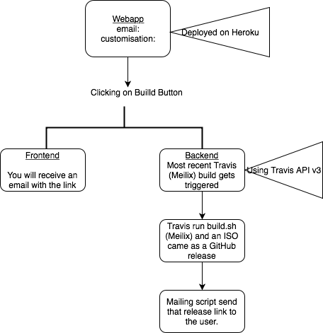
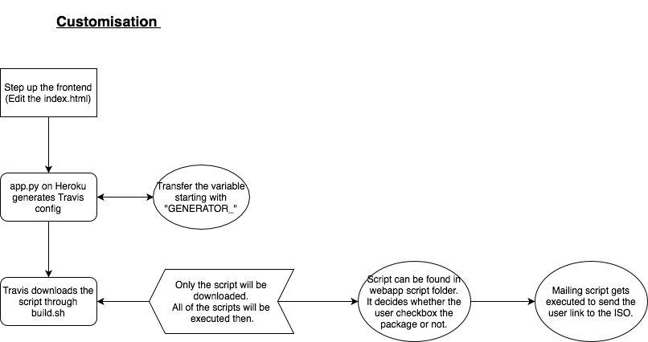

# Meilix Generator

Webapp to generate customized iso(live) images of [Meilix](https://github.com/fossasia/meilix) Linux.

        

Gitter channel [https://gitter.im/fossasia/meilix](https://gitter.im/fossasia/meilix)

## Table of Contents

* [Meilix components](#meilix-components)
* [Under the hood](#under-the-hood)
* [Working](#working)
    * [Webapp](#webapp)
    * [Generator](#generator)
    * [Scripts](#scripts)
    * [Work flow](#work-flow)
* [Installation](#installation)
* [Contributions](#contributions)
* [Issues and Branch policy](#issues-and-branch-policy)
* [Best Practices](#best-practices)
* [License](#license)

## Meilix Generator Features

 Following are some of the other features that Meilix-Generator offers:

- You can brand your Linux as you want. Your company name and logo can be your:
    - Linux name
    - Linux logo
    - Wallpaper
    - Screensaver

- Switch on/off various features of your linux. You can switch: 
    - 64 Bit support (or legacy 32 Bit)
    - Notifications
    - Screensaver
    - Sleep Modes 
    - System Sounds
    - Bookmarks
    - Screen Dimming
    - Power Management Saving 
    - Taskbar Autohide

- Following apps can be pre-installed in your linux: 
    - Chromium
    - Firefox
    - Hangout
    - VLC
    - GIMP
    - Inkscape
    - LibreOffice
    - Git
    - NextCloud
    - Dropbox

- Add all the documents and files you need in your linux.
- System Lock: it allows you to freeze all the systems you are hosting using Meilix. 
## Meilix-Generator components

* [fossasia/meilix](https://github.com/fossasia/meilix) hosts the source of Meilix based on Lubuntu.
* The bootscreen is build as a deb package in [fossasia/meilix-artwork](https://github.com/fossasia/meilix-artwork).
* The webapp is used to trigger a Meilix build based on the user configuration. Builds are run on Travis and the user is mailed a link download the custom build. Builds are released to [Github releases](https://github.com/fossasia/meilix/releases).
* Meilix Generator follows the standard front end of other FOSSASIA projects like [Open Event Webapp](https://github.com/fossasia/open-event-webapp)

## Under the hood

* [Flask](http://flask.pocoo.org/) used as the backend framework
* [Bootstrap](http://getbootstrap.com/) the frontend
* [Heroku](https://www.heroku.com/) is used to host the webapp
* [Travis](travis-ci.org) is where builds are made, and
* [Github Release](https://help.github.com/articles/creating-releases/) for the custom releases

## Working
### Webapp

The webapp rests in 2 templates, served by Flask:

- [index.html](templates/index.html)
- [build.html](templates/build.html)

### Generator

The generator runs on Flask, routes contained in main [app script](app.py)

* The route `/` renders the `index.html` which is used to
* `/output` route triggers the build on [Meilix](https://github.com/fossasia/meilix) and renders the `build.html`

### Scripts

`/output` route runs the [script.sh](script.sh) which in turn sends a `curl` request to Travis to trigger a build a Meilix repo. The request is sent with a JSON payload which contains information like which packages to pre-install, homepage URL, browser choice, build architechture, etc.

[travis_tokens](travis_tokens) has configuration required by Travis, it specifies on which branch to trigger build on.

### Work flow

Webapp is hosted at https://meilix-generator.herokuapp.com. Required configuration is obtained from the form and the user triggers the build. When the build is complete on the Meilix repo, the user is mailed with the link to download the iso image. Look at [build.sh](https://github.com/fossasia/meilix/blob/master/build.sh) and [.travis.yml](https://github.com/fossasia/meilix/blob/master/.travis.yml) on the Meilix repo for insight on the actual build process.

## Installation

The meilix-generator can be easily deployed onto a variety of platforms. Platform specific installation instructions have been provided below:

1. [Local installation](docs/installation/local.md)
2. [Deployment to Heroku](docs/installation/heroku.md)
3. [Docker container](docs/installation/docker.md)

## Contributions

This is an Open Source project and we would be happy to see contributors who report bugs and file feature requests, submitting pull requests as well. Please report issues here https://github.com/fossasia/meilix-generator/issues

**Note:** Make sure to fork both `meilix` and `meilix-generator` and to use your own token. Refer to [my_token.md](my_token.md) for details.

## Issues and Branch policy

Before making a pull request, please file an issue. So other developers will have a chance to give feedback or discuss upon. Match every pull request with an issue please and add the issue number in description e.g. like `Fixes #123`.

**Go for only one issue per pull request**

We have the following branches
* **master**
    All development goes on in the master branch. If you're making a contribution, you are supposed to make a pull request to master. PRs to the branch must pass a build check and a unit-test check on Travis.

## Best practices

* Go through [CONTRIBUTING.md](.github/CONTRIBUTING.md) before making any contribution.
* Do read the [Open Source Developer Guide and Best Practices at FOSSASIA](https://blog.fossasia.org/open-source-developer-guide-and-best-practices-at-fossasia).

**Write-up containing project buildup**
* These documents will help you to know more about the backbone of the project: [Flask](https://docs.google.com/document/d/1TWsz0aP0vLwXwcTX1VC58lEYy5dM6xvxnAABEtzyUZY/edit?usp=sharing) and [Heroku Travis Integration](https://docs.google.com/document/d/19xBAbjH04e_KlWwzGiDCDVAs4bLv-d-lcjKyr6bTRWE/edit?usp=sharing) and [Token Generation](https://docs.google.com/document/d/1agoZ3pSKjUfwSAJ3Yu0m-P08M4ERPIjiwSOSU3bubG0/edit?usp=sharing)

## License

This project is currently licensed under GNU Lesser General Public License v3.0 (LGPL-3.0). A copy of LICENSE.md should be present along with the source code. To obtain the software under a different license, please contact FOSSASIA.

*If you like the project, don't forget to **star** it.*
